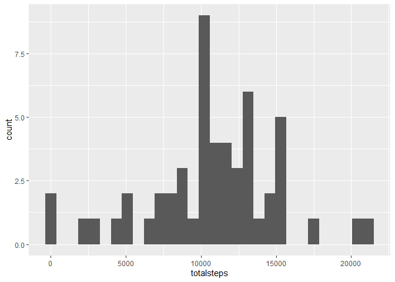
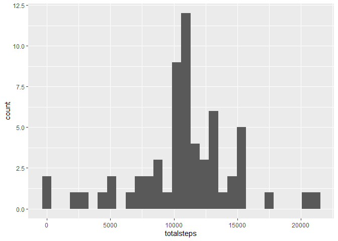
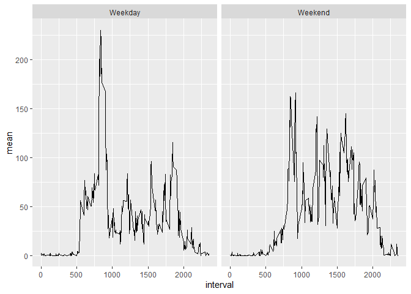

## Loading and preprocessing the data

**Loading the library needed**


```r
library(dplyr)
library(ggplot2)
```

**Extract and read the data**


```r
unzip("activity.zip")

activity <- read.csv("activity.csv", stringsAsFactors = FALSE)

activity$date <- as.Date(activity$date) #convert to 'date' format
```


## What is mean total number of steps taken per day?

**Sum of steps, grouped by date**


```r
activity_perday <- activity %>%
  group_by(date) %>%
  summarize(totalsteps = sum(steps))
```

**Plot a histogram of mean total number of steps taken per day**


```r
activity_perday %>%
  ggplot(aes(x=totalsteps)) +
  geom_histogram()
```

```
## `stat_bin()` using `bins = 30`. Pick better value with `binwidth`.
```

```
## Warning: Removed 8 rows containing non-finite values (stat_bin).
```

<!-- -->

## What is the average daily activity pattern?

**Calculate the mean and median of steps taken per day**


```r
mean_median_perday <- activity %>%
  group_by(date) %>%
  summarize(totalsteps = sum(steps, na.rm = TRUE)) %>%
  summarize(mean = mean(totalsteps),
            median = median(totalsteps))
```

**Calculate the mean of steps based on certain interval**


```r
groupedbyinterval <- activity %>%
  group_by(interval) %>%
  summarize(mean = mean(steps, na.rm = TRUE))
```

**Plot a line plot of mean of steps based on certain interval**


```r
groupedbyinterval %>%
  ggplot(aes(x=interval, y=mean)) + 
  geom_line()
```

<!-- -->

**Finding the maximum interval and mean of steps**


```r
groupedbyinterval[which(groupedbyinterval$mean == max(groupedbyinterval$mean)),]
```

```
## # A tibble: 1 x 2
##   interval  mean
##      <int> <dbl>
## 1      835  206.
```


## Imputing missing values

**Calculate the sum of missing datas**


```r
(totalna = sum(is.na(activity$steps)))
```

```
## [1] 2304
```

**Impute the missing steps datas using the mean of the related intervals**


```r
activity_imp <- activity #copying the whole dataset
activity_imp$steps_imp <- activity_imp$steps #copy original steps to new column

for (x in 1:length(activity_imp$steps_imp)){
    if(is.na(activity_imp$steps[x]) == TRUE){
      activity_imp$steps_imp[x] <- round(groupedbyinterval$mean[which(groupedbyinterval$interval == activity_imp$interval[x])])
    }
}
```

**Calculate the sum of steps per day using imputed values from code chunk before**


```r
activity_imp_perday <- activity_imp %>%
  group_by(date) %>%
  summarize(totalsteps = sum(steps_imp))
```

**Plot a histogram of mean total number of steps taken per day using the imputed datas**


```r
activity_imp_perday %>%
  ggplot(aes(x=totalsteps)) +
  geom_histogram()
```

```
## `stat_bin()` using `bins = 30`. Pick better value with `binwidth`.
```

<!-- -->

****Calculate the mean and median of steps taken per day using the imputed datas**


```r
mean_median_imp_perday <- activity_imp %>%
  group_by(date) %>%
  summarize(totalsteps = sum(steps_imp, na.rm = TRUE)) %>%
  summarize(mean = mean(totalsteps),
            median = median(totalsteps))
```


## Are there differences in activity patterns between weekdays and weekends?

**Calculate the mean of steps taken, grouped by Weekend or Weekday**


```r
activity_imp$dayend <- ifelse(weekdays(activity_imp$date) == "Saturday" | weekdays(activity_imp$date) == "Sunday", 
                              "Weekend", 
                              "Weekday")

activity_imp_grouped_dayend <- activity_imp %>%
  group_by(dayend, interval) %>%
  summarize(mean = mean(steps_imp, na.rm = TRUE))
```

**Plot a line plot of mean of steps based on certain interval using the imputed datas, grouped by Weekend or Weekday**


```r
activity_imp_grouped_dayend %>%
  ggplot(aes(x=interval, y=mean)) +
  geom_line() +
  facet_wrap(~dayend)
```

<!-- -->
